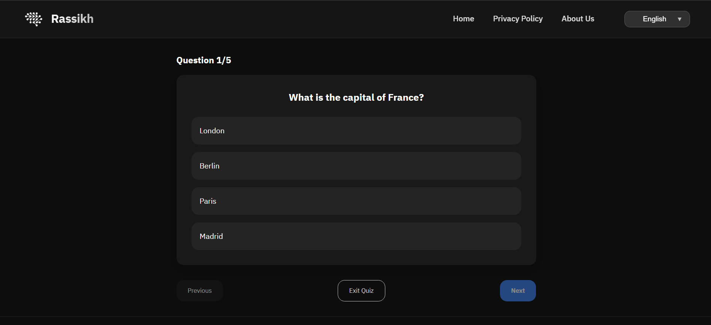
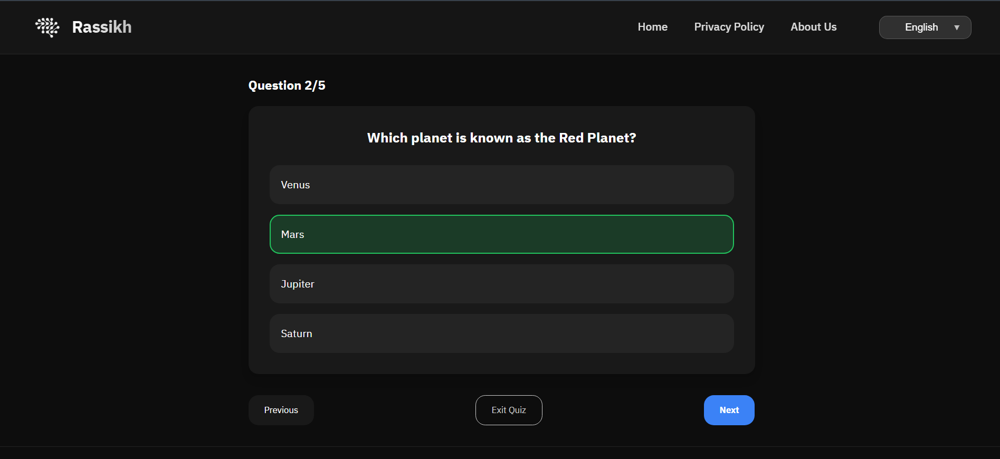
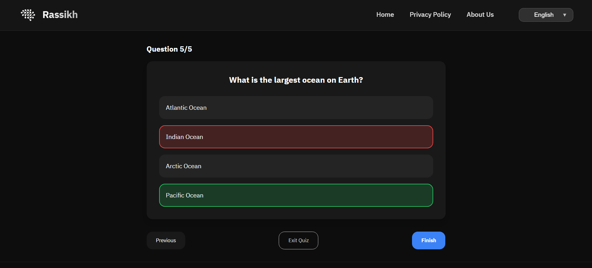
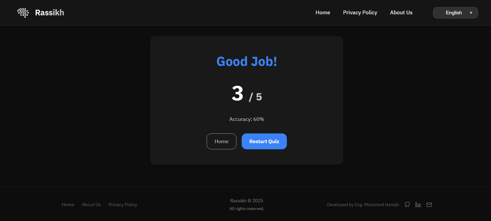

  

  # Rassikh - Create Your Quiz

  

    <a href="mohamed-h7.github.io/Rassikh/">
      Click here to try it
    </a>
  
  

---

# Rassikh
Rassikh is a smart and simple tool built to help you create your own quizzes easily and quickly.

Whether you have text-based questions, questions extracted from images, or questions taken from PDF files, you can send them to any AI model to convert them into the specific format required by the website. Once you paste them into the input box, Rassikh instantly generates an interactive quiz ready to be solved.

You can also ask an AI model to generate entirely new questions for any topic you choose—such as networking, programming, medicine, history, and more—then paste them directly to create a complete quiz without needing your own questions beforehand.

The platform aims to provide a smooth experience for anyone who needs a quick quiz or an effective review session, whether a student evaluating their understanding or preparing for an exam.

Rassikh is not a ready-made question bank. Instead, it is a quiz generator that transforms your own content into a clear and interactive learning experience.

## 🎯 What Does Rassikh Offer?
- Convert text questions into a structured quiz with one click
- Support for multiple-choice questions
- Lightweight and fast interface suitable for all devices
- Ability to mark the correct answer for each question
- Navigation between questions within the quiz
- Interactive experience that enhances understanding and revision
- A simple and direct quiz creation process without complex tools or configurations

## 🧠 Why the Name “Rassikh”?
We chose the name Rassikh (“rooted” or “deeply established” in Arabic) because we believe real learning begins with making mistakes—then correcting them.

Every time a person makes a mistake and understands why, the information becomes more deeply rooted in their mind.

This is the idea behind Rassikh:

Instead of making mistakes in the real exam, create a virtual quiz and practice beforehand.

If you make mistakes while practicing, that is exactly the goal—so you can reinforce the information, discover your weak points, and correct them before the actual test.

When you face a question, think about the answer, and then see the result—whether correct or wrong—the information becomes more firmly established in your brain.

And this is the philosophy of the platform:

`Every question, every attempt, every answer… helps root your knowledge more deeply.`

The name "Rassikh" implies stability, deep understanding, and rooting knowledge in a practical way that relies on interaction, not just memorization.

---
# Screenshots | لقطات شاشة:

